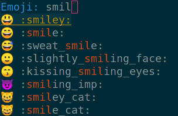

[](https://melpa.org/#/ivy-emoji)

# ivy-emoji

Insert emoji in Emacs buffers using the [ivy](https://github.com/abo-abo/swiper)
selection framework.

## Installation

The recommended way to install `ivy-emoji` is by using [MELPA](https://melpa.org/).
Alternatively, clone this repo and add the path to your
`load-path` variable. Using `use-package`, this can be done in the following
way:
``` emacs-lisp
(use-package ivy-emoji
  :load-path  "/path/to/ivy-emoji"
  :bind ("C-c i e" . ivy-emoji) ;; mnemonics i e = insert emoji
)
```

`ivy-emoji` produces the list of all the emojis by scanning ranges of code
points. A code point is an object of the form `#x1f000` which corresponds to an
unicode symbol (U+1F000). The unicode numbers corresponding to all the emojis
can be found [here](https://unicode.org/emoji/charts/full-emoji-list.html). The
variable `ivy-emoji-codepoint-ranges` takes a list of ranges that have to be
scanned. In case some emoji are missing, make sure that their unicode number is
in one the ranges analyzed by `ivy-emoji`. If they are not, modify the
`ivy-emoji-codepoint-ranges` variable.

Alternatively, you can use the list of emojis provided by other packages. For
example, to use the emojis defined by
[telega.el](https://github.com/zevlg/telega.el):
``` emacs-lisp
(require 'telega-util)
(telega-emoji-init)
(setq ivy-emoji-list
      (mapcar (lambda (emoji)
               (concat (cdr emoji) " " (car emoji)))
               telega-emoji-alist))
```
Or, to use the ones in [company-emoji](https://github.com/dunn/company-emoji):
```emacs-lisp
(require 'company-emoji-list)
(setq ivy-emoji-list
     (mapcar '(lambda (emoji)
                (concat
                 (get-text-property 0 :unicode emoji) " "
                 (substring-no-properties emoji)))     ;; Print the name
             (company-emoji-list-create)))
```

The format has to be "EMOJI NAME", for example "🌵 CACTUS".

### Dependencies

Emacs has to be able to properly render emojis, so a suitable font is required.
Noto Color Emoji is reccomended for optimal results. It may be useful to add the
following line to the configuration file to ensure that Noto Color Emoji is
chosen to render emojis.

``` emacs-lisp
(set-fontset-font t 'symbol (font-spec :family "Noto Color Emoji") nil 'prepend)
```

## Usage

Just run `ivy-emoji`, the minibuffer will populate with all the available emoji
(see screenshot), the one you select will be insert at the point.



## Similar packages

* [company-emoji](https://github.com/dunn/company-emoji): This package uses
  [company](https://github.com/company-mode/company-mode) to insert unicode
  emoji by typing directly in the buffer. `company-emoji` requires
  `company-mode` and its emoji list cannot be (easily) modified.

* [emacs-emojify](https://github.com/iqbalansari/emacs-emojify): This packages
  substitutes emoji names with the corresponding images (and hence, it does not
  require a font with emoji). `emojify` provides a command similar to
  `ivy-emoji`: `emojify-insert-emoji`. However, this does not really insert
  unicode emojis, but it insert text that is rendered as a picture emoji when
  `emojify-mode` is enabled.
